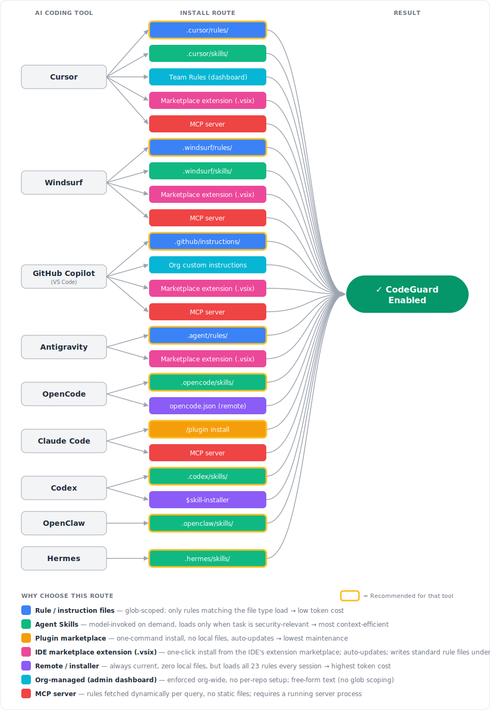

# Choosing an Install Path

Project CodeGuard ships the same security ruleset through several delivery mechanisms — rule files, Agent Skills, plugin marketplaces, remote URLs, org dashboards, and MCP. The rules are identical; what changes is **how they reach your AI coding tool**, **who maintains them**, and **how much context they consume**.

This page helps you pick the right path for your situation. For step-by-step install commands per tool, see [Getting Started → Installation](getting-started.md#installation).



---

## Quick Recommendation

| Your situation | Use this route | Why |
|:---|:---|:---|
| **Solo developer, one repo** | Rule / instruction files | Glob-scoped — only rules matching the file you're editing load. Lowest token cost, simplest setup. |
| **Team sharing via git** | Rule files or Agent Skills, **project-scoped** | Committed to the repo — every contributor gets CodeGuard automatically on clone. |
| **Want zero local files / auto-updates** | Plugin marketplace (Claude Code) or remote instructions (OpenCode) | One command, no files to maintain, always current. |
| **Prefer a one-click install from your IDE's extension marketplace** | IDE marketplace extension (Cursor, Windsurf, Antigravity, VS Code host for Copilot) | Familiar "install extension" UX; auto-updates through the marketplace; one package covers all four VS Code-family IDEs. |
| **Org admin enforcing policy** | Org-managed dashboard (Cursor Team Rules, Copilot org instructions) | Centrally enforced across every repo without per-project setup. |
| **Already running MCP infrastructure** | MCP server (self-hosted) | Rules served dynamically; integrates with your existing MCP tooling. |

!!! tip "Not sure? Start here"
    Download the pre-built rule files for your tool from the [releases page](https://github.com/cosai-oasis/project-codeguard/releases) and drop them into your repo. You can switch routes later — the underlying rules are the same.

## Fast Decision Tree

Use this if you want the shortest path to the right install route:

1. **Are you choosing for just yourself, for one repo/team, or for a whole company?**
   `Just me` → Start with [user-scope](#project-scope-vs-user-scope) **rule files** or **skills**
   `One repo / one team` → Start with [project-scope](#project-scope-vs-user-scope) **rule files**
   `Whole company / many repos` → Look at **org-managed rules** or **MCP**
2. **Do you want the simplest and most predictable setup?**
   `Yes` → Use **rule / instruction files**
   `No, I want guidance loaded only when relevant` → Use **Agent Skills**
3. **Do you need one centrally managed live source of truth across many repos or clients?**
   `No` → Stay with **rule files** or **skills**
   `Yes` → Use **MCP** if you already operate that infrastructure
4. **Do you want zero local files and automatic updates from the tool or URL?**
   `Yes` → Use the tool's **plugin marketplace** or **remote installer/instructions** option where available
   `No` → Keep the files in the repo for reviewability and git history

**Default answers if you're unsure**

- **Individual user:** user-scope or project-scope **rule files**
- **Team/repository:** project-scoped **rule files**
- **Tool with strong skill support and you want on-demand loading:** **Agent Skills**
- **Platform/security team centralizing policy across many repos:** **org-managed rules** first, **MCP** if you need a service-based architecture

---

## Who Are You Deploying For?

Before picking a mechanism, decide **who** should end up with CodeGuard active. Each audience implies a different install location and a different set of administrative responsibilities.

=== "Just me (individual)"

    You install CodeGuard on your own machine; no one else is affected.

    **Responsible CoSAI personas:** Application Developer, AI System Users

    **Install location:** [User scope](#project-scope-vs-user-scope) (`~/.cursor/rules/`, `~/.codex/skills/`, Claude Code `/plugin install`, etc.)

    **Admin responsibilities**

    - None beyond your own machine — no approvals, no PRs.
    - You are responsible for updating your local copy when new CodeGuard releases ship.
    - Rules are **not** visible in code review and **not** shared with collaborators.

    **Choose this when:** evaluating CodeGuard, contributing to repos you don't control, or you want the rules everywhere you personally work.

=== "My team / repository"

    CodeGuard is committed to a repository so every contributor gets it on `git clone`.

    **Responsible CoSAI personas:** Application Developer (repo owners and contributors), AI System Governance (review and approval for enforced defaults)

    **Install location:** [Project scope](#project-scope-vs-user-scope) (`<repo>/.cursor/rules/`, `<repo>/.github/instructions/`, `<repo>/.claude/settings.json`, etc.)

    **Admin responsibilities**

    - Requires write access to the repo and a reviewed PR to land the rule files.
    - Someone on the team owns updates — either manually on each CodeGuard release or via the [auto-update GitHub Action](getting-started.md#keeping-rules-updated-automated), which still needs a reviewer to merge its PRs.
    - Rule changes are visible in diff/PR history, so treat them like any other code change (review, CODEOWNERS, branch protection).
    - If contributors use different AI tools, you may need to commit multiple format directories (`.cursor/`, `.windsurf/`, `.github/`, …) and keep them in sync.

    **Choose this when:** you want consistent security guidance for everyone working in a specific codebase. This is the **recommended default** for most teams.

=== "My whole organization"

    CodeGuard is enforced centrally across all repos and members, regardless of whether individual repos opt in.

    **Responsible CoSAI personas:** AI System Governance (primary owner), Agentic Platform and Framework Providers (tool/IDE configuration), AI Platform Provider (if a centrally hosted MCP server is involved)

    **Install location:** Vendor admin dashboard (Cursor Team Rules, GitHub Copilot organization custom instructions) or a centrally operated MCP server.

    **Admin responsibilities**

    - Requires **org-admin / owner privileges** in the AI tool's dashboard — typically a security or platform team, not individual developers.
    - You become the single point of update: when CodeGuard ships a new release, an admin must paste/upload the new rules into the dashboard (or redeploy the MCP server).
    - Dashboard rules are usually free-form text with no glob scoping, so weigh the context-window cost of loading all rules for every file against the benefit of guaranteed coverage.
    - Plan for governance: change-control on who can edit org rules, an audit trail of edits, and a rollback procedure if a rule update causes problems.
    - Communicate to developers that org-level rules are active so behavior changes aren't a surprise.

    **Choose this when:** security policy must be enforced uniformly and you can't rely on every repo opting in.

!!! info "These layers stack"
    Org-level rules give you a guaranteed baseline; team/repo-level adds project-specific or stricter rules on top; individual user-scope lets a developer trial new rules locally. Most tools merge all active layers — see [Project scope vs user scope](#project-scope-vs-user-scope) for precedence.

---

## How Each Route Works

### Rule / instruction files

Static markdown files the AI tool reads from a known directory. Each rule declares which file globs it applies to, so only relevant rules load per file.

- **Supported by:** Cursor (`.cursor/rules/`), Windsurf (`.windsurf/rules/`), GitHub Copilot (`.github/instructions/`), Antigravity (`.agent/rules/`)
- **Best for:** Most users. Predictable, version-controlled, diffable in PRs.
- **Tradeoffs:** You update by re-downloading (or use the [auto-update workflow](getting-started.md#keeping-rules-updated-automated)).
- **Responsible CoSAI personas:** Application Developer, with AI System Governance for policy review in PRs.

### Agent Skills

A skill is a self-describing capability the model invokes **on demand** when the task is security-relevant. Nothing loads until the model decides it's needed.

- **Supported by:** Cursor (`.cursor/skills/`), Windsurf (`.windsurf/skills/`), OpenCode (`.opencode/skills/`), Codex (`.codex/skills/`), OpenClaw (`.openclaw/skills/`), Hermes (`.hermes/skills/`)
- **Best for:** Context-sensitive workflows, polyglot repos, tools that natively support the [Agent Skills standard](https://agentskills.io/).
- **Tradeoffs:** Activation depends on the model recognizing the task as security-relevant. Slightly less deterministic than always-on rule files.
- **Responsible CoSAI personas:** Application Developer, with Agentic Platform and Framework Providers supplying the skill discovery and invocation model.

### Plugin marketplace

A managed install: one command, the tool fetches and updates the skill for you.

- **Supported by:** Claude Code (`/plugin install codeguard-security@project-codeguard`)
- **Best for:** Claude Code users who want the lowest-maintenance setup.
- **Tradeoffs:** Claude Code only. See the [Claude Code Plugin guide](claude-code-skill-plugin.md) for details.
- **Responsible CoSAI personas:** Application Developer, with Agentic Platform and Framework Providers (Claude Code) and AI System Governance for managed-settings enforcement.

### IDE marketplace extension

A VS Code-compatible extension (`.vsix`) published to an IDE marketplace. Installing the extension writes the CodeGuard rule/instruction files into the correct directory for the host IDE (`.cursor/rules/`, `.windsurf/rules/`, `.agent/rules/`, or `.github/instructions/`) and keeps them up to date through the marketplace's normal extension-update channel.

- **Supported by:** Cursor, Windsurf, Antigravity, and VS Code (which is the host process for GitHub Copilot). All four are VS Code-family IDEs and consume the same `.vsix` format, typically via Open VSX and/or the Visual Studio Marketplace.
- **Best for:** Developers who prefer the familiar "install an extension" UX over downloading release zips, and teams that want marketplace-driven auto-updates without running their own infrastructure.
- **Tradeoffs:**
    - Installs to **user scope** by default — rules apply to every workspace on the machine, not just a single repo. The extension can offer a command (e.g. `CodeGuard: Install Rules Into Workspace`) to copy the files into project scope when you want them committed to git.
    - Because the extension writes standard rule files, the end state is the same as the **Rule / instruction files** route — marketplace install is just the delivery mechanism.
    - Extension updates flow outside of repo history; if you rely on pinned, reviewed rules in git, prefer project-scoped rule files instead.
    - Each IDE's marketplace has its own publishing workflow; a single `.vsix` covers all four IDEs but may need to be listed in multiple marketplaces (Open VSX, Visual Studio Marketplace, and any IDE-specific registry).
- **Responsible CoSAI personas:** Application Developer (installs and runs the extension), with Agentic Platform and Framework Providers (the IDEs hosting the extension) and AI System Governance (reviewing the extension before org-wide rollout).

!!! note "CodeGuard does not currently ship a marketplace extension"
    This route is shown for completeness. If you want to deliver CodeGuard through a VS Code-compatible extension, package the rule files from `sources/core/` into a `.vsix` that copies them into the appropriate IDE directory on activation. Until a signed CodeGuard extension is published, the supported ready-to-use paths are **rule files**, **Agent Skills**, and the **Claude Code plugin marketplace**.

### Remote / installer

The tool pulls rules from a URL or installer command at runtime — no local files.

- **Supported by:** OpenCode (`opencode.json` remote `instructions` URLs), Codex (`$skill-installer`)
- **Best for:** Always-current rules without managing files; ephemeral / CI environments.
- **Tradeoffs:** Loads the **full CodeGuard ruleset every session** regardless of language — highest token cost. Requires network access. Pin to a release tag (e.g. `refs/tags/v1.3.0`) if you need a stable, auditable snapshot.
- **Responsible CoSAI personas:** Application Developer, with Agentic Platform and Framework Providers (OpenCode, Codex) owning the remote loader and installer behavior.

### Org-managed (admin dashboard)

An administrator configures the rules once in the vendor's team/org settings; they then apply to **every member** automatically, with no per-repo or per-machine setup.

- **Best for:** Security/platform teams enforcing a baseline org-wide.
- **Tradeoffs:** Free-form text — no glob scoping, so all rules load for every file. Updates require admin action.
- **Responsible CoSAI personas:** AI System Governance, with Agentic Platform and Framework Providers (Cursor, GitHub Copilot, Claude Code) enforcing org-level configuration and AI Platform Provider for endpoint/MDM management where applicable.

=== "Cursor — Team Rules"

    Cursor Business/Teams plans let admins define **Team Rules** in the Cursor dashboard. These rules are pushed to every team member's Cursor client and are applied in addition to any project-level `.cursor/rules/`.

    **Setup**

    1. Sign in to the [Cursor dashboard](https://cursor.com/dashboard) as a team admin.
    2. Navigate to **Settings → Rules** for your team.
    3. Paste the CodeGuard rule content (concatenate the markdown files from `sources/core/`, or pick the always-apply subset to keep context cost down).
    4. Save — rules propagate to all team members on their next Cursor session.

    **Admin notes**

    - Requires a Cursor Business/Teams plan and the **team admin** role.
    - Team Rules are free-form text; there is no per-language glob scoping at this layer.
    - Members cannot opt out, but project-level `.cursor/rules/` still load alongside Team Rules.

    :material-book-open-page-variant: [Cursor Rules documentation](https://docs.cursor.com/en/context/rules)

=== "GitHub Copilot — Organization custom instructions"

    GitHub organization owners can set **custom instructions** that apply to every Copilot seat in the org, across all repositories — independent of any repo-level `.github/instructions/` files.

    **Setup**

    1. Go to your organization on GitHub → **Settings → Copilot → Custom instructions**.
    2. Paste the CodeGuard rule content (concatenate the markdown files from `sources/core/`, or use the always-apply subset).
    3. Save — instructions take effect for all org members with a Copilot seat.

    **Admin notes**

    - Requires **organization owner** (or delegated Copilot admin) permissions and a Copilot Business/Enterprise plan.
    - Org instructions are free-form text; glob scoping is only available at the repository level via `.github/instructions/`.
    - Repository-level `.github/instructions/` and `.github/copilot-instructions.md` continue to apply on top of org instructions.

    :material-book-open-page-variant: [GitHub Copilot custom instructions documentation](https://docs.github.com/en/copilot/how-tos/configure-custom-instructions)

=== "Claude Code — Managed settings"

    Claude Code supports an **enterprise managed settings** file deployed via your device-management tooling (MDM, Jamf, Intune, etc.). Settings in this file are enforced for every user on the machine and **cannot be overridden** by user or project settings — so you can guarantee the CodeGuard plugin is installed and enabled.

    **Setup**

    1. Create a managed settings file at the system path for your platform:

        | Platform | Path |
        |:---|:---|
        | macOS | `/Library/Application Support/ClaudeCode/managed-settings.json` |
        | Linux / WSL | `/etc/claude-code/managed-settings.json` |
        | Windows | `C:\ProgramData\ClaudeCode\managed-settings.json` |

    2. Add the CodeGuard marketplace and plugin:

        ```json
        {
          "marketplaces": [{ "source": "cosai-oasis/project-codeguard" }],
          "plugins": [
            {
              "name": "codeguard-security",
              "marketplace": "project-codeguard",
              "enabled": true
            }
          ]
        }
        ```

    3. Distribute the file to managed devices via your MDM / configuration-management system.

    **Admin notes**

    - Requires the ability to write to system-level paths on managed endpoints (typically IT / endpoint-management, not a web dashboard).
    - Managed settings take precedence over `~/.claude/settings.json` and `<repo>/.claude/settings.json`; users cannot disable the plugin locally.
    - Updates to the CodeGuard plugin itself flow from the marketplace — you only redeploy `managed-settings.json` if you change which plugins are enforced.

    :material-book-open-page-variant: [Claude Code settings documentation](https://docs.claude.com/en/docs/claude-code/settings) · [Plugin guide](claude-code-skill-plugin.md)

!!! note "Tools without an org-admin layer"
    Not every tool offers centrally pushed rules. For these, use **project-scope** install (commit rules to each repo) or a shared template repository as your enforcement mechanism:

    - **OpenCode** — open-source CLI with no vendor dashboard; closest equivalent is a shared `opencode.json` committed to repos.
    - **Codex, Antigravity, Windsurf** — check current vendor documentation; at the time of writing we have not verified an org-level rule-push mechanism for these tools.
    - **OpenClaw, Hermes** — filesystem-based skill discovery only; no central admin layer.

### MCP server

The AI tool connects to a Model Context Protocol server that exposes CodeGuard rules as a resource or tool. Rules are fetched dynamically per query rather than stored as static files.

- **Supported by:** Cursor, Windsurf, GitHub Copilot, Claude Code (any MCP-capable client)
- **Best for:** Teams that already operate MCP infrastructure and want centralized, live rule serving.
- **Tradeoffs:** Requires a running server process. Adds network latency. You manage the server lifecycle.
- **Responsible CoSAI personas:** AI Platform Provider (hosts and operates the MCP server), with AI System Governance owning the served policy, Agentic Platform and Framework Providers integrating MCP into IDEs, and Application Developer consuming the MCP-served rules.

!!! note "CodeGuard does not currently ship an MCP server"
    This route is shown for completeness. If you want to serve CodeGuard rules over MCP, wrap the markdown files from `sources/core/` in your own MCP server. The other routes on this page are the supported, ready-to-use paths.

---

## Responsible CoSAI Personas Per Install Route

Project CodeGuard aligns with the [CoSAI standard personas](personas.md) (see the [upstream YAML definitions](https://github.com/cosai-oasis/secure-ai-tooling/blob/main/risk-map/yaml/personas.yaml)). Use this table to see who is typically responsible for implementing and operating each install route.

| Install route | Primary CoSAI personas | Supporting CoSAI personas |
|:---|:---|:---|
| Rule / instruction files (project scope) | Application Developer | AI System Governance (policy review and enforcement in PRs) |
| Rule / instruction files (user scope) | Application Developer, AI System Users | — |
| Agent Skills (project scope) | Application Developer | AI System Governance, Agentic Platform and Framework Providers |
| Agent Skills (user scope) | Application Developer, AI System Users | Agentic Platform and Framework Providers |
| Plugin marketplace (Claude Code) | Application Developer | Agentic Platform and Framework Providers, AI System Governance |
| IDE marketplace extension (Cursor, Windsurf, Antigravity, VS Code host for Copilot) | Application Developer | Agentic Platform and Framework Providers, AI System Governance |
| Remote instructions / installer (OpenCode, Codex) | Application Developer | Agentic Platform and Framework Providers |
| Org-managed dashboard (Cursor Team Rules, GitHub Copilot org custom instructions, Claude Code managed settings) | AI System Governance | Agentic Platform and Framework Providers, AI Platform Provider (for endpoint management) |
| MCP server (self-hosted) | AI Platform Provider | AI System Governance, Agentic Platform and Framework Providers, Application Developer |

!!! note "Why these personas"
    CodeGuard install routes are primarily operated by developers integrating AI tools into their workflows (Application Developer), the platforms that deliver those AI tools (Agentic Platform and Framework Providers), the central teams that set and enforce security policy (AI System Governance), and the platform teams that host shared services such as an MCP server (AI Platform Provider). Individual end users consuming AI-assisted code benefit from these controls (AI System Users), but are not usually the implementers of the install path.

## Skills vs MCP: Which Should I Use?

This choice is usually clearer if you compare **three** routes, not two:

- **Rule files** are static markdown files committed to a repo or installed on a machine. They are the most predictable and reviewable option.
- **Agent Skills** package those same rules as an on-demand capability the model can invoke when the task is security-relevant.
- **MCP** turns the rules into a service the client fetches from at runtime, which is useful when you want central control or integration with existing platform infrastructure.

In practice, the question is less "skills vs MCP" and more:

1. Do you want the rules to live **in the repo as files**, or **behind a service**?
2. Do you want security guidance to be **always available/predictable**, or **loaded only when relevant**?
3. Are you optimizing for **simplicity**, or for **centralized administration and live updates**?

### What each route is really for

| | Rule files | Agent Skills | MCP server |
|:---|:---|:---|:---|
| **What it is** | Static rules/instructions on disk | Static skill on disk that the model can invoke | Dynamic rules served by a local or remote service |
| **Where rules live** | In the repo or user's home directory | In the repo or user's home directory | On a running MCP server |
| **How guidance appears** | Tool loads applicable files automatically | Model decides to invoke the skill when needed | Agent calls an MCP tool/resource to fetch guidance |
| **Operational overhead** | Lowest | Low | Highest |
| **Freshness** | Pinned to what's installed/committed | Pinned to what's installed/committed | Can be updated centrally without touching every repo |
| **Auditability in PRs** | Excellent | Excellent when project-scoped | Server changes happen outside repo history unless you add your own change-control |
| **Offline support** | Yes | Yes | Only if the server is reachable locally |
| **Best fit** | Default for most repos and teams | On-demand guidance without running infrastructure | Organizations that already operate MCP and want a central source of truth |

### Decision logic

If you want the shortest path to "secure-by-default AI output," choose **rule files** first.

- They are the easiest to explain to a team.
- They are visible in git history and code review.
- They work well with project-scope installs, which is the cleanest default for most repositories.
- They do not depend on the model recognizing when to invoke a skill or on a server being available.

Choose **Agent Skills** when you want on-demand loading but still want a file-based install.

- Skills are especially useful in tools that support the Agent Skills pattern well.
- They can reduce unnecessary context loading in broader or polyglot repos.
- They are still simple to distribute because they are just files in the repo or user profile.
- The tradeoff is that activation is model-driven, so behavior is slightly less deterministic than with always-available rule files.

Choose **MCP** when your real requirement is **centralization**, not just "on-demand loading."

- MCP is best when you already run platform infrastructure and want CodeGuard delivered from one managed place.
- It is a good fit when multiple repos, multiple teams, or multiple clients should all pull from the same live policy source.
- It also makes sense if you want to combine CodeGuard with other MCP-served context, approvals, logging, or platform workflows.
- It is usually the wrong starting point for a single repo because it adds server deployment, client registration, connectivity, and lifecycle management.

### If you are an individual user

For one developer deciding what to install on their own machine:

| Your goal | Recommended route | Why |
|:---|:---|:---|
| **I want the simplest, most predictable setup** | Rule files | Lowest setup effort, easiest to understand, works offline, no extra moving parts |
| **I want lower context usage and my tool supports skills well** | Agent Skills | Keeps the install file-based but lets the model pull in security guidance only when relevant |
| **I want to experiment with a local AI platform or custom tooling** | MCP | Reasonable only if you are already running local MCP for other reasons |

**Individual-user recommendation:** start with **project-scoped rule files** if you control the repo, or **user-scoped rule files / skills** if you want CodeGuard everywhere on your machine. Use MCP only if you are intentionally building a more advanced local setup.

### If you are a company, platform team, or security team

For an organization, the decision is usually driven by **governance and scale**, not by raw install convenience.

| Your goal | Recommended route | Why |
|:---|:---|:---|
| **Standardize a specific repository or template repo** | Project-scoped rule files or project-scoped skills | Versioned with the codebase, reviewable in PRs, easy for developers to understand |
| **Give teams a shared baseline without running new infrastructure** | Org-managed dashboard rules when the tool supports them | Central admin control without per-repo installation, though usually with higher context cost |
| **Serve one live policy source across many repos/tools/clients** | MCP | Best when centralization, dynamic delivery, and platform integration matter more than simplicity |

For most companies, a practical rollout looks like this:

1. Start with **project-scoped rule files** in important repos to prove value and keep the rollout reviewable.
2. Add **skills** in tools that benefit from on-demand loading.
3. Move to **org-managed rules** or **MCP** only when you have a clear administrative reason: central policy ownership, shared platform services, audit workflows, or multi-repo standardization at scale.

### Bottom line

- **Rule files** are the best default for most people and most repos.
- **Skills** are the best file-based option when you want more selective, on-demand guidance.
- **MCP** is the right answer when your main problem is centralized policy delivery and platform integration, not when you simply need to install CodeGuard in one repo.

---

## Project Scope vs User Scope

Most tools look for rules/skills in **two** places: inside the current repository (project scope) and in your home directory (user scope). Both are valid; pick based on who should get the rules.

=== "Project scope (recommended)"

    Install into the repository so the rules are committed to git.

    | Tool | Path |
    |:---|:---|
    | Cursor | `<repo>/.cursor/rules/` |
    | Windsurf | `<repo>/.windsurf/rules/` |
    | GitHub Copilot | `<repo>/.github/instructions/` |
    | Antigravity | `<repo>/.agent/rules/` |
    | OpenCode | `<repo>/.opencode/skills/` |
    | Codex | `<repo>/.codex/skills/` |
    | Claude Code | `<repo>/.claude/settings.json` (plugin entry) |
    | OpenClaw | `<repo>/.openclaw/skills/` |
    | Hermes | `<repo>/.hermes/skills/` |

    **Use when:** You want every contributor to get CodeGuard automatically on `git clone`, and you want rule changes reviewed in PRs.

    !!! tip "Repository Level Installation"
        Installing at the repository level ensures all team members benefit from the security rules automatically when they clone the repository.

=== "User scope"

    Install into your home directory so the rules apply to **every** project you open on this machine.

    | Tool | Path |
    |:---|:---|
    | Cursor | `~/.cursor/rules/` |
    | Windsurf | `~/.windsurf/rules/` |
    | OpenCode | `~/.config/opencode/skills/` |
    | Codex | `~/.codex/skills/` |
    | Claude Code | `~/.claude/skills/` or `/plugin install` (user-global by default) |
    | OpenClaw | `~/.openclaw/skills/` |
    | Hermes | `~/.hermes/skills/` |

    **Use when:** You can't (or don't want to) commit files to the repo — e.g. open-source contributions, client projects, quick experiments — but still want CodeGuard active everywhere you work.

    !!! warning
        User-scope installs are **not shared** with teammates and won't appear in code review. Prefer project scope for team repos.

**Precedence:** Most tools merge both locations. When the same rule exists in both, the project-scoped copy generally takes precedence — check your tool's documentation for exact behavior.

---

## Next Steps

[Install for your tool →](getting-started.md#installation){ .md-button .md-button--primary }
[Claude Code Plugin →](claude-code-skill-plugin.md){ .md-button }
[FAQ →](faq.md){ .md-button }
